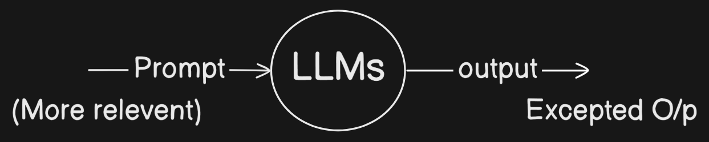
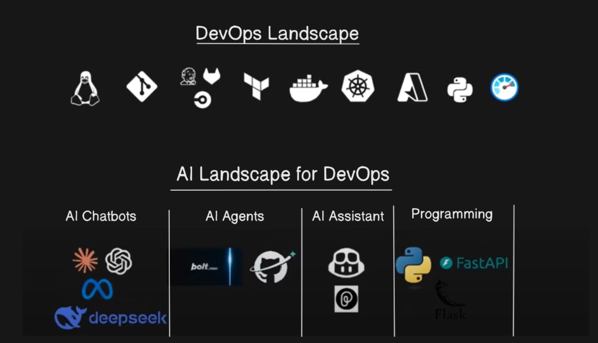

# Day-01

### 1. What is Traditional AI ?
- It has been there since 1950s. 
- The usecase of traditional AI is to **predict the events.**
- Traditional AI relies on **structured data, pre-defined rules, and predictive models** trained on historical data.

*Example:* If you ask about the temp. of Vizag on 28th Mar at 10 AM. The AI model will show some result. 

Based on the trained data it will give some O/p. 

##### UseCase in DevOps: Incident Detection & Prediction

Predicting system failures before they occur.

**How It Works:**
- Uses **log-based anomaly detection** and **pattern recognition** (e.g., time-series forecasting).

- If CPU usage suddenly spikes beyond a threshold, AI predicts a potential issue.

- The system alerts DevOps teams to take preventive action.

**Limitations:**
- Works only on pre-trained scenarios.
- Cannot generate insights beyond structured input data.

---

### 2. Generative AI (GenAI) 

Generative AI leverages Large Language models (LLMs) to **analyze** and **generate** new data (or) content dynamically. 

##### UseCase in DevOps:  AI-Powered Incident Resolution & RCA

- **Use Case:** Automating root cause analysis (RCA) 

- **How It Works:**
    - Understanding logs & metrics: Gen AI processes unstructured log data, summarizes key issues, and suggests fixes.
    - **Chat-based troubleshooting:** DevOps engineers can ask Gen AI:
"Why did my Kubernetes pod crash?" → AI analyzes logs and suggests probable causes like OOM (Out of Memory) errors.

- **Advantages:**
  - Can generate human-like explanations & solutions.
  - Adaptable to new/unseen failure patterns.

---

### Key Differences Summary
| Feature            | Traditional AI                     | Generative AI                     |
|-------------------|--------------------------------|--------------------------------|
| **Data Type**      | Structured (logs, metrics)    | Structured + Unstructured (logs, docs, chat)  |
| **Approach**       | Predict the event | Generate the new data |
| **Use Case**       | Detect anomalies, forecast failures | Explain failures, automate remediation |
| **Example**        | Alerts on high CPU usage       | Summarizes logs & suggests fixes |
| **Limitation**     | Requires labeled datasets     | May generate incorrect suggestions (hallucinations) |

---

### 3. Large Language Model (LLMs)

- A Large Language Model (LLM) is an advanced AI system trained on vast amounts of text data to understand, generate, and process human language
- These models use deep learning techniques, particularly transformers (like GPT, BERT, or LLaMA), to recognize patterns, predict words, and generate human-like responses.

### 4. Prompt Engineering 
- If you want to talk with other human being language is the medium 
- If you want to communicate with LLMs we use prompt 
- The more relevent prompt you give the exact output you will get.

### 5. AI Landscape

### 6. Task 
- Create a GitHub repository that contains a bash script. when executed the bash script confirms the health of a virtual machine by looking at the parameters such as cpu, disk space, memory. 
 
   
- 💡**Please note** that the bash script should also support a command line argument named "explain", when passed, *"explain"* provides the detailed summary of the health status.

